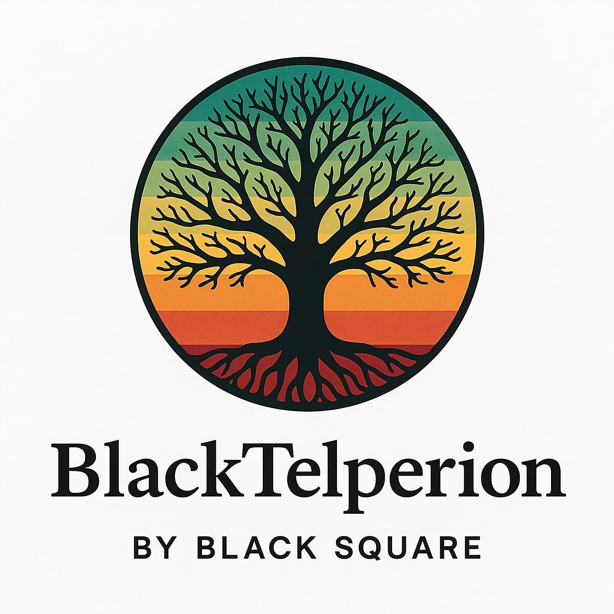

<p align="center">
  
</p>

# BlackTelperion

BlackTelperion is Black Square's specialized proprietary library for the processing and analysis of hyperspectral and multispectral imagery across multiple platforms. Named after Telperion, the silver tree that illuminated the world with its radiant light in Tolkien's legendarium, our library transforms spectral information into clear, meaningful data. Designed for remote sensing applications, BlackTelperion offers robust capabilities for capturing, processing, and interpreting spectral data from various platforms.

## Purpose

BlackTelperion serves as a unified framework for processing spectral imagery from various sources:
- Sentinel-2 (ESA)
- ASTER (NASA/METI)
- ENMAP (DLR)
- Hyspex (Our hyperspectral camera)
- Additional platforms (planned for future integration)

## Repository Structure

```
BS-Hyperion/
├── io/                           # Input/output operations
│   └── platform_specific/        # Platform-specific I/O handlers
├── processing_boxes/             # Core processing modules
│   ├── base_processing_box.py    # Abstract base class for all processors
│   ├── enmap/                    # EnMAP-specific processing
│   ├── aster/                    # ASTER-specific processing
│   ├── sentinel/                 # Sentinel-2 specific processing
│   └── Hyspex/                   # Hyspex (our camera) specific processing
├── pipelines/                    # Ready-to-use processing pipelines
│   ├── base_pipeline.py          # Pipeline infrastructure
└── utils/                        # Utility functions and shared tools
```

## Getting Started

### Prerequisites

- Python 3.9+
- GDAL/OGR
- NumPy
- Xarray
- Rasterio
- Scikit-learn
- PyTorch (for deep learning components)

### Installation

For team members:

```bash
# Clone the repository
git clone git@github.com:blacksquare/BlackTelperion.git

# Install in development mode
cd BlackTelperion
pip install -e .
```

## Documentation

Internal documentation and examples can be found in the project wiki.

## Basic Usage

```python

#To be defined

```

## Development Guidelines

### Adding New Processing Modules

1. Create a new class in the appropriate platform-specific directory
2. Inherit from `BaseProcessingBox`
3. Implement the required methods
4. Add unit tests

### Creating New Pipelines

Pipelines combine multiple processing boxes to create end-to-end workflows. See `base_pipeline.py` for the interface definition.

## Contributing

All team members are encouraged to contribute. Please follow these steps:

1. Create a feature branch from `develop`
2. Implement your changes with appropriate tests
3. Submit a pull request
4. Request review from a team member

## Internal Use Only

This repository and its contents are proprietary to Black Square and intended for internal use only. Do not share access or distribute code outside the organization.

## Contact

For questions or issues:
- Create an issue in this repository
- Contact the Spectral Processing Team

## Future Development

- Additional satellite platforms integration
- Deep learning-based feature extraction
- Cloud-optimized processing pipelines
